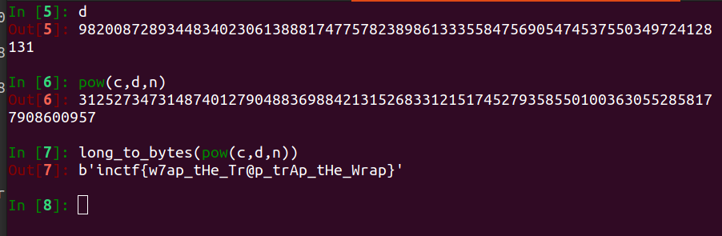

## Challenge name 
HakUnA MaTaTa

### description
My friend said that no one can find his message. Is it so? Help me to retrieve that message.
### flag format
inctf{...}
### Author
[Pavani](https://twitter.com/Paavani21)

### Challenge file
[Challenge file](parameter.py)

### Challenge Writeup
This is a easy challenge with small change. See the behaviour of publickey_factors,we know that factors usally used to multiply,now see how the product if factors is working.You have both `n,ct` but not `e`.So lets assume it as `e` (public key) and move forward.
Here `e` is large value, which means `d`(private key) would be small value.Which means one of the possible attacks is [**Wieners attack** ](https://en.wikipedia.org/wiki/Wiener%27s_attack).

Conditions for applying Wieners attack:
if $d < \frac{1}{3}N^\frac{1}{4}$,then one of the convergents of Continued Fraction of $e/N$ is $k/d$.

For finding real k,d pair, use the following conditions: 

`d` must be odd number.
`d,k` it must satisfy 
$$ed = 1 \space mod \space ϕ(n)$$  $\phi(n)$ --->even number
$$\phi(n) = \frac{ed-1}{k}$$
$$ϕ(n) = (p-1)(q-1)$$
$$\phi(n) = N-p+q+1$$
$$p+q = N - \phi(n) + 1$$
Now apply quaratic equations on p,q
$$(x-p)(x-q) = 0$$
$$x^2 - (p+q)x + pq = 0 $$
now check if discrement is an int or not,if it is , find roots for the above equation.
so, if u have d,use can use it for finding plaintext
we know that,
``py
pt = long_to_bytes(pow(ct,d,n))
``

### flag = inctf{w7ap_tHe_Tr@p_trAp_tHe_Wrap}'

